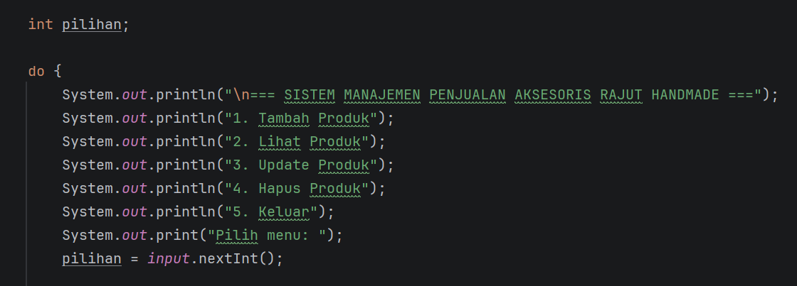
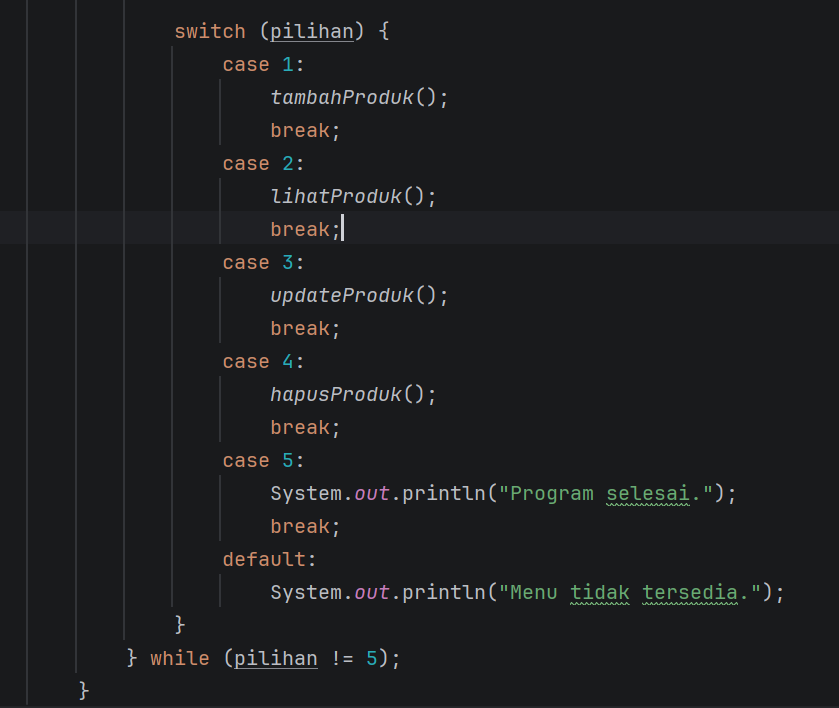
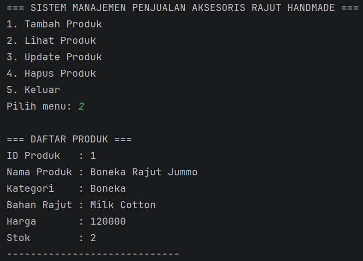
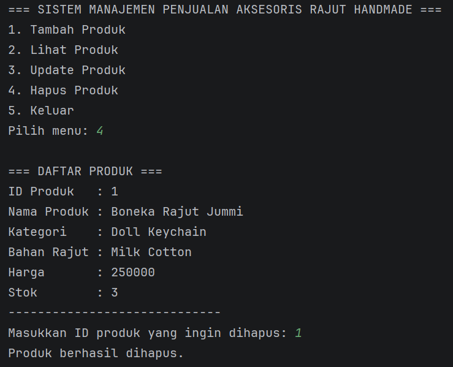

# LAPORAN PRAKTIKUM

## POSTTEST 1

### PEMROGRAMAN BERORIENTASI OBJEK

Disusun oleh:
Alya Mayasha (2409106054)
Kelas B1'24

Program Studi Informatika
Universitas Mulawarman
2026


# 1. Analisis Program

Program ini merupakan program Sistem Manajemen Penjualan Aksesoris Rajut Handmade yang dibuat menggunakan bahasa pemrograman Java dengan konsep Object Oriented Programming (OOP).

Program ini memungkinkan pengguna untuk mengelola data produk aksesoris rajut melalui fitur CRUD (Create, Read, Update, Delete)**.

Fitur yang tersedia dalam program ini antara lain:

### 1. Create (Tambah Produk)

Pengguna dapat menambahkan produk baru dengan memasukkan beberapa data seperti:

* Nama Produk
* Kategori Produk
* Bahan Rajut
* Harga
* Stok

Data tersebut kemudian disimpan ke dalam ArrayList sehingga dapat dikelola secara dinamis.

### 2. Read (Lihat Produk)

Fitur ini memungkinkan pengguna untuk melihat daftar produk yang telah ditambahkan sebelumnya. Data produk akan ditampilkan dalam bentuk daftar yang berisi informasi lengkap mengenai produk.

### 3. Update (Edit Produk)

Fitur ini memungkinkan pengguna untuk memperbarui data produk berdasarkan ID produk yang dipilih. Data yang dapat diperbarui meliputi:

* Nama produk
* Kategori
* Bahan rajut
* Harga
* Stok

### 4. Delete (Hapus Produk)

Fitur ini digunakan untuk menghapus data produk dari daftar berdasarkan ID produk yang dipilih oleh pengguna.

Program menggunakan beberapa class untuk merepresentasikan data yaitu:

* Produk → menyimpan data utama produk
* Kategori → menyimpan kategori produk rajut
* BahanRajut → menyimpan jenis bahan rajut yang digunakan

Data produk disimpan dalam ArrayList<Produk> sehingga jumlah data dapat bertambah atau berkurang secara dinamis.

Program menggunakan struktur perulangan do-while agar menu terus muncul sampai pengguna memilih opsi keluar.


# 3. Source Code

## A. Class Produk

Class Produk digunakan untuk menyimpan informasi utama dari produk aksesoris rajut seperti ID produk, nama produk, kategori, bahan rajut, harga, dan stok.

Pada class ini juga terdapat variabel counter yang digunakan untuk membuat ID produk secara otomatis.

```java
public class Produk {

    static int counter = 1;

    int id;
    String namaProduk;
    Kategori kategori;
    BahanRajut bahan;
    int harga;
    int stok;

    public Produk(String namaProduk, Kategori kategori, BahanRajut bahan, int harga, int stok) {
        this.id = counter++;
        this.namaProduk = namaProduk;
        this.kategori = kategori;
        this.bahan = bahan;
        this.harga = harga;
        this.stok = stok;
    }

    public int getId() {
        return id;
    }

    public String getNamaProduk() {
        return namaProduk;
    }

    public void setNamaProduk(String namaProduk) {
        this.namaProduk = namaProduk;
    }

    public Kategori getKategori() {
        return kategori;
    }

    public void setKategori(Kategori kategori) {
        this.kategori = kategori;
    }

    public BahanRajut getBahan() {
        return bahan;
    }

    public void setBahan(BahanRajut bahan) {
        this.bahan = bahan;
    }

    public int getHarga() {
        return harga;
    }

    public void setHarga(int harga) {
        this.harga = harga;
    }

    public int getStok() {
        return stok;
    }

    public void setStok(int stok) {
        this.stok = stok;
    }
}
```

## B. Class Kategori

Class Kategori digunakan untuk menyimpan jenis kategori produk rajut.

Contoh kategori:

* Tas Rajut
* Boneka Rajut
* Gantungan Kunci Rajut

```java
public class Kategori {

    String namaKategori;

    public Kategori(String namaKategori) {
        this.namaKategori = namaKategori;
    }

    public String getNamaKategori() {
        return namaKategori;
    }

    public void setNamaKategori(String namaKategori) {
        this.namaKategori = namaKategori;
    }
}
```

## C. Class BahanRajut

Class BahanRajut digunakan untuk menyimpan jenis bahan rajut yang digunakan dalam pembuatan produk.

```java
public class BahanRajut {

    String namaBahan;

    public BahanRajut(String namaBahan) {
        this.namaBahan = namaBahan;
    }

    public String getNamaBahan() {
        return namaBahan;
    }

    public void setNamaBahan(String namaBahan) {
        this.namaBahan = namaBahan;
    }
}
```

## D. Menu Program (Main)

Menu utama program digunakan untuk memanggil fungsi CRUD berdasarkan pilihan pengguna menggunakan struktur switch-case dan perulangan do-while.





# 4. Hasil Output

Berikut merupakan hasil tampilan program saat dijalankan.

## Menu Utama


## Tambah Produk


## Lihat Produk



## Update Produk


## Hapus Produk




