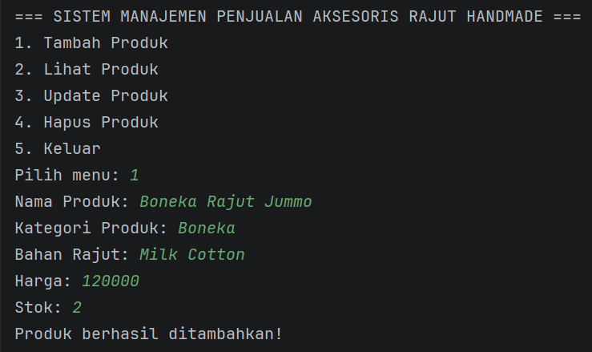
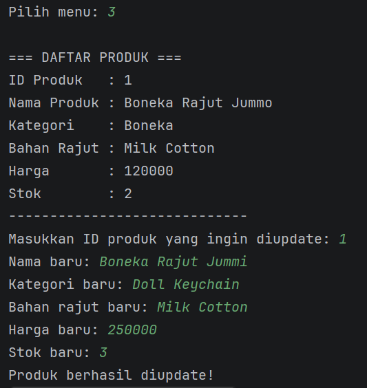

# LAPORAN PRAKTIKUM

## POSTTEST 2

### PEMROGRAMAN BERORIENTASI OBJEK

Disusun oleh:
Alya Mayasha (2409106054)
Kelas B1'24

Program Studi Informatika
Universitas Mulawarman
2026


# 1. Analisis Program

Program ini merupakan program Sistem Manajemen Penjualan Aksesoris Rajut Handmade yang dibuat menggunakan bahasa pemrograman Java dengan konsep Object Oriented Programming (OOP). Program ini memungkinkan pengguna untuk mengelola data produk aksesoris rajut melalui fitur CRUD (Create, Read, Update, Delete).

Program ini juga dibuat dengan penerapan konsep Encapsulation. Encapsulation merupakan konsep dalam OOP yang digunakan untuk menyembunyikan data dalam sebuah class dan hanya mengizinkan akses melalui method tertentu seperti getter dan setter. Dengan demikian, data pada class tidak dapat diakses secara langsung dari luar class sehingga keamanan dan kontrol terhadap data menjadi lebih baik.

Konsep Encapsulation yang diterapkan pada program ini yaitu mengubah atribut pada class menjadi private, mengakses atribut menggunakan getter, mengubah nilai atribut menggunakan setter, menambahkan validasi pada setter, menggunakan berbagai access modifier seperti public, private, protected, dan default.

Fitur yang tersedia dalam program ini antara lain:

### 1. Create (Tambah Produk)

Pengguna dapat menambahkan produk baru dengan memasukkan beberapa data seperti:

* Nama Produk
* Kategori Produk
* Bahan Rajut
* Harga
* Stok

Data tersebut kemudian disimpan ke dalam ArrayList sehingga dapat dikelola secara dinamis.

### 2. Read (Lihat Produk)

Fitur ini memungkinkan pengguna untuk melihat daftar produk yang telah ditambahkan sebelumnya. Data produk akan ditampilkan dalam bentuk daftar yang berisi informasi lengkap mengenai produk.

### 3. Update (Edit Produk)

Fitur ini memungkinkan pengguna untuk memperbarui data produk berdasarkan ID produk yang dipilih. Data yang dapat diperbarui meliputi:

* Nama produk
* Kategori
* Bahan rajut
* Harga
* Stok

### 4. Delete (Hapus Produk)

Fitur ini digunakan untuk menghapus data produk dari daftar berdasarkan ID produk yang dipilih oleh pengguna.
Program menggunakan beberapa class untuk merepresentasikan data yaitu:

* Produk → menyimpan data utama produk
* Kategori → menyimpan kategori produk rajut
* BahanRajut → menyimpan jenis bahan rajut yang digunakan

Data produk disimpan dalam ArrayList<Produk> sehingga jumlah data dapat bertambah atau berkurang secara dinamis.
Program menggunakan struktur perulangan do-while agar menu terus muncul sampai pengguna memilih opsi keluar.

# 2. Penerapan Encapsulation

Konsep Encapsulation diterapkan dengan cara menyembunyikan atribut dalam class menggunakan access modifier private, serta menyediakan method getter dan setter untuk mengakses dan mengubah data tersebut.
Dengan menggunakan encapsulation, data dalam class tidak dapat diakses secara langsung dari luar class sehingga lebih aman dan terkontrol.

Contoh penerapan encapsulation pada class Produk:

```java
private String namaProduk;
private int harga;
private int stok;
```

Atribut tersebut hanya dapat diakses melalui method getter dan setter seperti:
```java
public int getHarga() {
    return harga;
}

public void setHarga(int harga) {
    if (harga < 0) {
        System.out.println("Harga tidak boleh negatif.");
        this.harga = 0;
    } else {
        this.harga = harga;
    }
}
```

# 3. Access Modifier

### 1. Private
Access modifier private digunakan untuk menyembunyikan atribut dalam class agar tidak dapat diakses langsung dari luar class.
contoh : 
```java
private String namaProduk;
private int harga;
private int stok;
```

### 2. Public
Access modifier public digunakan pada method seperti getter, setter, dan constructor agar dapat diakses dari class lain.
Contoh : 
```java
public int getHarga() {
    return harga;
}
```

### 3. Protected
Access modifier protected digunakan pada atribut id dalam class Produk.
```java
protected int id;
```

### 4. Default (Package-Private)
Access modifier default digunakan pada variabel counter yang berfungsi untuk menghasilkan ID produk secara otomatis. Variabel ini hanya dapat diakses dalam package yang sama yaitu aksesorisrajut.
```java
private static int counter = 1;
```


# 4. Source Code

## A. Class Produk

Class Produk digunakan untuk menyimpan informasi utama dari produk aksesoris rajut seperti ID produk, nama produk, kategori, bahan rajut, harga, dan stok. 
Pada class ini juga terdapat variabel counter yang digunakan untuk membuat ID produk secara otomatis.

```java
package aksesorisrajut;

public class Produk {

    private static int counter = 1;

    protected int id;
    private String namaProduk;
    private Kategori kategori;
    private BahanRajut bahan;
    private int harga;
    private int stok;

    public Produk(String namaProduk, Kategori kategori, BahanRajut bahan, int harga, int stok) {
        this.id = counter++;
        this.namaProduk = namaProduk;
        this.kategori = kategori;
        this.bahan = bahan;
        setHarga(harga);
        setStok(stok);
    }

    public int getId() {
        return id;
    }

    public String getNamaProduk() {
        return namaProduk;
    }

    public void setNamaProduk(String namaProduk) {
        if (namaProduk.isEmpty()) {
            System.out.println("Nama produk tidak boleh kosong.");
        } else {
            this.namaProduk = namaProduk;
        }
    }

    public Kategori getKategori() {
        return kategori;
    }

    public void setKategori(Kategori kategori) {
        this.kategori = kategori;
    }

    public BahanRajut getBahan() {
        return bahan;
    }

    public void setBahan(BahanRajut bahan) {
        this.bahan = bahan;
    }

    public int getHarga() {
        return harga;
    }

    public void setHarga(int harga) {
        if (harga < 0) {
            System.out.println("Harga tidak boleh negatif.");
            this.harga = 0;
        } else {
            this.harga = harga;
        }
    }

    public int getStok() {
        return stok;
    }

    public void setStok(int stok) {
        if (stok < 0) {
            System.out.println("Stok tidak boleh negatif.");
            this.stok = 0;
        } else {
            this.stok = stok;
        }
    }
}
```

## B. Class Kategori

Class Kategori digunakan untuk menyimpan jenis kategori produk rajut.

```java
package aksesorisrajut;

public class Kategori {

    private String namaKategori;

    public Kategori(String namaKategori) {
        this.namaKategori = namaKategori;
    }

    public String getNamaKategori() {
        return namaKategori;
    }

    public void setNamaKategori(String namaKategori) {
        this.namaKategori = namaKategori;
    }
}
```

## C. Class BahanRajut

Class BahanRajut digunakan untuk menyimpan jenis bahan rajut yang digunakan dalam pembuatan produk.

```java
package aksesorisrajut;

public class BahanRajut {

    private String namaBahan;

    public BahanRajut(String namaBahan) {
        this.namaBahan = namaBahan;
    }

    public String getNamaBahan() {
        return namaBahan;
    }

    public void setNamaBahan(String namaBahan) {
        this.namaBahan = namaBahan;
    }
}
```

## D. Menu Program (Main)

Menu utama program digunakan untuk memanggil fungsi CRUD berdasarkan pilihan pengguna menggunakan struktur switch-case dan perulangan do-while.

```java
package aksesorisrajut;

import java.util.ArrayList;
import java.util.Scanner;

public class Main {

    static ArrayList<Produk> daftarProduk = new ArrayList<>();
    static Scanner input = new Scanner(System.in);

    public static void main(String[] args) {

        int pilihan;

        do {
            System.out.println("\n=== SISTEM MANAJEMEN PENJUALAN AKSESORIS RAJUT HANDMADE ===");
            System.out.println("1. Tambah Produk");
            System.out.println("2. Lihat Produk");
            System.out.println("3. Update Produk");
            System.out.println("4. Hapus Produk");
            System.out.println("5. Keluar");
            System.out.print("Pilih menu: ");
            pilihan = input.nextInt();

            switch (pilihan) {
                case 1:
                    tambahProduk();
                    break;
                case 2:
                    lihatProduk();
                    break;
                case 3:
                    updateProduk();
                    break;
                case 4:
                    hapusProduk();
                    break;
                case 5:
                    System.out.println("Program selesai.");
                    break;
                default:
                    System.out.println("Menu tidak tersedia.");
            }
        } while (pilihan != 5);
    }

    static void tambahProduk() {
        input.nextLine();

        System.out.print("Nama Produk: ");
        String nama = input.nextLine();

        System.out.print("Kategori Produk: ");
        String namaKategori = input.nextLine();
        Kategori kategori = new Kategori(namaKategori);

        System.out.print("Bahan Rajut: ");
        String namaBahan = input.nextLine();
        BahanRajut bahan = new BahanRajut(namaBahan);

        System.out.print("Harga: ");
        int harga = input.nextInt();

        System.out.print("Stok: ");
        int stok = input.nextInt();

        Produk produkBaru = new Produk(nama, kategori, bahan, harga, stok);
        daftarProduk.add(produkBaru);

        System.out.println("Produk berhasil ditambahkan!");
    }

    static void lihatProduk() {

        if (daftarProduk.isEmpty()) {
            System.out.println("Belum ada data produk.");
            return;
        }

        System.out.println("\n=== DAFTAR PRODUK ===");

        for (Produk p : daftarProduk) {
            System.out.println("ID Produk   : " + p.getId());
            System.out.println("Nama Produk : " + p.getNamaProduk());
            System.out.println("Kategori    : " + p.getKategori().getNamaKategori());
            System.out.println("Bahan Rajut : " + p.getBahan().getNamaBahan());
            System.out.println("Harga       : " + p.getHarga());
            System.out.println("Stok        : " + p.getStok());
            System.out.println("-----------------------------");
        }
    }

    static void updateProduk() {

        if (daftarProduk.isEmpty()) {
            System.out.println("Data produk kosong.");
            return;
        }

        lihatProduk();

        System.out.print("Masukkan ID produk yang ingin diupdate: ");
        int id = input.nextInt();
        input.nextLine();

        for (Produk p : daftarProduk) {
            if (p.getId() == id) {

                System.out.print("Nama baru: ");
                p.setNamaProduk(input.nextLine());

                System.out.print("Kategori baru: ");
                String kategoriBaru = input.nextLine();
                p.setKategori(new Kategori(kategoriBaru));

                System.out.print("Bahan rajut baru: ");
                String bahanBaru = input.nextLine();
                p.setBahan(new BahanRajut(bahanBaru));

                System.out.print("Harga baru: ");
                p.setHarga(input.nextInt());

                System.out.print("Stok baru: ");
                p.setStok(input.nextInt());

                System.out.println("Produk berhasil diupdate!");
                return;
            }
        }

        System.out.println("Produk dengan ID tersebut tidak ditemukan.");
    }

    static void hapusProduk() {

        if (daftarProduk.isEmpty()) {
            System.out.println("Data produk kosong.");
            return;
        }

        lihatProduk();

        System.out.print("Masukkan ID produk yang ingin dihapus: ");
        int id = input.nextInt();

        for (int i = 0; i < daftarProduk.size(); i++) {
            if (daftarProduk.get(i).getId() == id) {
                daftarProduk.remove(i);
                System.out.println("Produk berhasil dihapus.");
                return;
            }
        }

        System.out.println("Produk tidak ditemukan.");
    }
}
```


# 4. Hasil Output

Berikut merupakan hasil tampilan program saat dijalankan.

## Menu Utama


## Tambah Produk



## Lihat Produk


## Update Produk



## Hapus Produk


