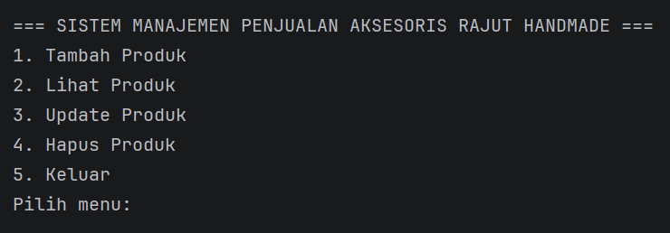
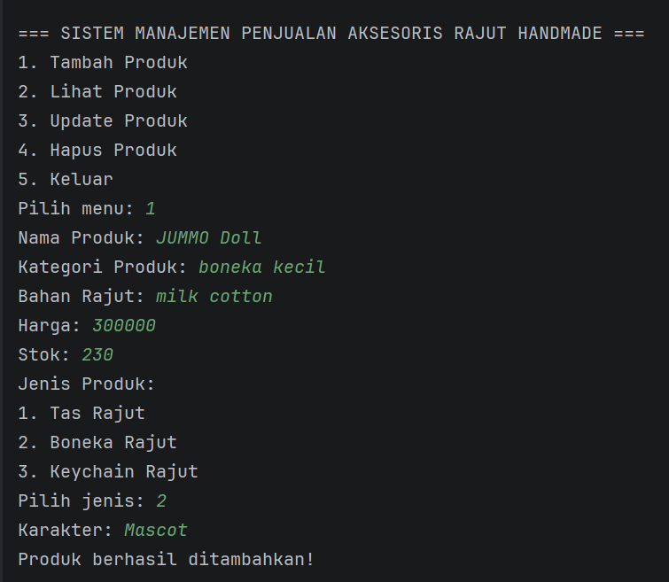
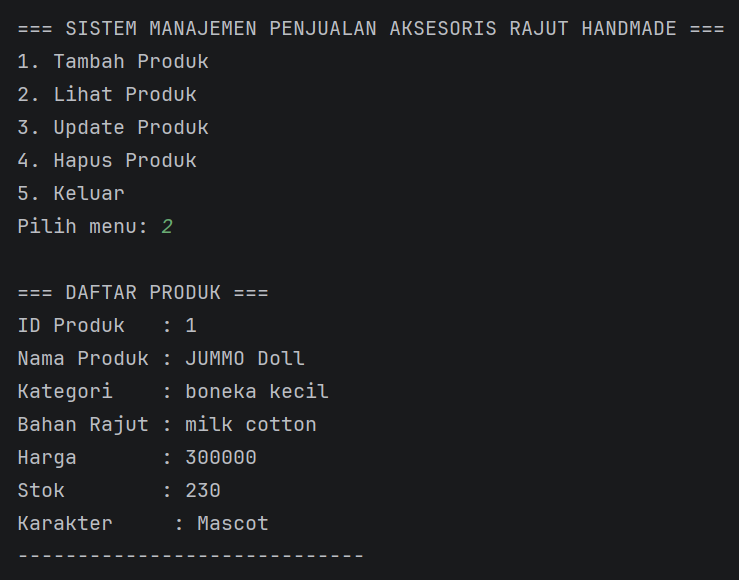
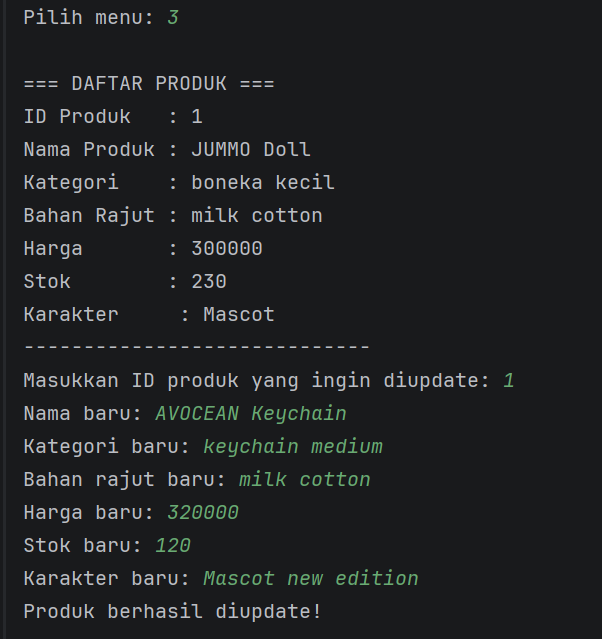
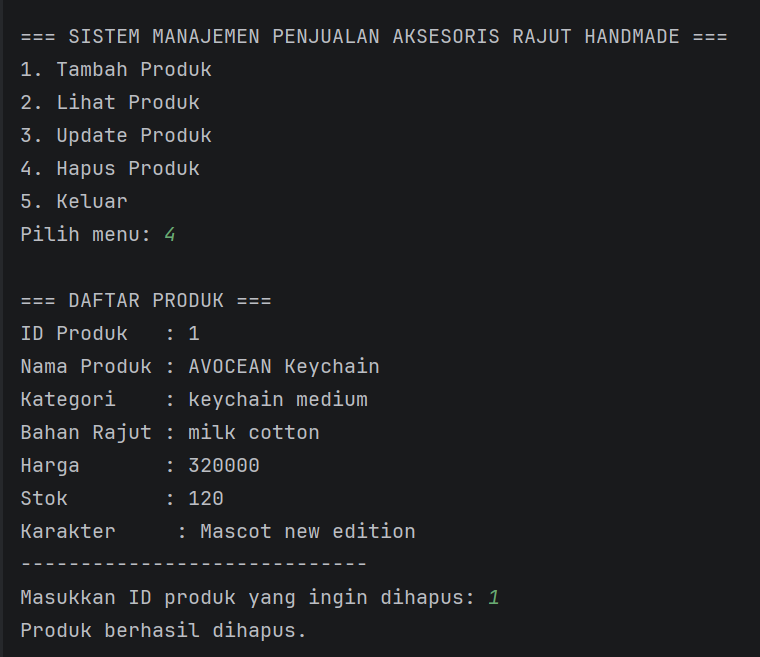

# LAPORAN PRAKTIKUM

## POSTTEST 3

### PEMROGRAMAN BERORIENTASI OBJEK

Disusun oleh:
Alya Mayasha (2409106054)
Kelas B1'24

Program Studi Informatika
Universitas Mulawarman
2026


# 1. Analisis Program

Program ini merupakan program Sistem Manajemen Penjualan Aksesoris Rajut Handmade yang dibuat menggunakan bahasa pemrograman Java dengan konsep Object Oriented Programming (OOP). Program ini memungkinkan pengguna untuk mengelola data produk aksesoris rajut melalui fitur CRUD (Create, Read, Update, Delete).

Program ini juga menerapkan konsep Encapsulation, yaitu teknik untuk menyembunyikan data dalam class dan hanya mengizinkan akses melalui method seperti getter dan setter. Dengan demikian, data tidak dapat diakses secara langsung dari luar class sehingga lebih aman dan terkontrol.

Selain itu, program ini juga menerapkan konsep Inheritance (pewarisan), dimana terdapat class utama yaitu Produk sebagai superclass yang diturunkan menjadi beberapa subclass seperti TasRajut, BonekaRajut, dan KeychainRajut. Setiap subclass memiliki atribut tambahan sesuai dengan jenis produknya, sehingga program menjadi lebih terstruktur dan mudah dikembangkan.

Fitur yang tersedia dalam program ini antara lain:

### 1. Create (Tambah Produk)

Pengguna dapat menambahkan produk baru dengan memasukkan beberapa data seperti:

* Nama Produk
* Kategori Produk
* Bahan Rajut
* Harga
* Stok
* Jenis Produk (Tas, Boneka, Keychain)

Setiap jenis produk memiliki atribut tambahan:

- TasRajut → model tas
- BonekaRajut → karakter boneka
- KeychainRajut → bentuk keychain

Data tersebut kemudian disimpan ke dalam ArrayList sehingga dapat dikelola secara dinamis.

### 2. Read (Lihat Produk)

Fitur ini memungkinkan pengguna untuk melihat daftar produk yang telah ditambahkan sebelumnya. Data produk akan ditampilkan dalam bentuk daftar yang berisi informasi lengkap mengenai produk.

### 3. Update (Edit Produk)

Fitur ini memungkinkan pengguna untuk memperbarui data produk berdasarkan ID produk yang dipilih. Data yang dapat diperbarui meliputi:

* Nama produk
* Kategori
* Bahan rajut
* Harga
* Stok

### 4. Delete (Hapus Produk)

Fitur ini digunakan untuk menghapus data produk dari daftar berdasarkan ID produk yang dipilih oleh pengguna.

# 2. Penerapan Inheritance

Konsep Inheritance diterapkan dengan cara membuat class turunan (subclass) dari class utama (superclass). Dalam program ini, class Produk berperan sebagai superclass yang memiliki atribut umum seperti nama produk, kategori, bahan, harga, dan stok.

Kemudian dibuat beberapa subclass yaitu TasRajut, BonekaRajut, dan KeychainRajut yang mewarisi seluruh atribut dan method dari class Produk. Setiap subclass memiliki atribut tambahan yang membedakan jenis produk.

Contoh penerapan inheritance pada class TasRajut:

```java
public class TasRajut extends Produk {

    private String model;

    public TasRajut(String namaProduk, Kategori kategori, BahanRajut bahan, int harga, int stok, String model) {
        super(namaProduk, kategori, bahan, harga, stok);
        this.model = model;
    }
}
```
Contoh penerapan inheritance pada class BonekaRajut:
```java
public class BonekaRajut extends Produk {

    private String karakter;

    public BonekaRajut(String namaProduk, Kategori kategori, BahanRajut bahan, int harga, int stok, String karakter) {
        super(namaProduk, kategori, bahan, harga, stok);
        this.karakter = karakter;
    }
}
```

Contoh penerapan inheritance pada class KeychainRajut:
```java
public class KeychainRajut extends Produk {

    private String bentuk;

    public KeychainRajut(String namaProduk, Kategori kategori, BahanRajut bahan, int harga, int stok, String bentuk) {
        super(namaProduk, kategori, bahan, harga, stok);
        this.bentuk = bentuk;
    }
}
```

# 3. Source Code

## A. Class Produk

Class Produk digunakan untuk menyimpan informasi utama dari produk aksesoris rajut seperti ID produk, nama produk, kategori, bahan rajut, harga, dan stok. 
Pada class ini juga terdapat variabel counter yang digunakan untuk membuat ID produk secara otomatis.

```java
package aksesorisrajut;

public class Produk {

    private static int counter = 1;

    protected int id;
    private String namaProduk;
    private Kategori kategori;
    private BahanRajut bahan;
    private int harga;
    private int stok;

    public Produk(String namaProduk, Kategori kategori, BahanRajut bahan, int harga, int stok) {
        this.id = counter++;
        this.namaProduk = namaProduk;
        this.kategori = kategori;
        this.bahan = bahan;
        setHarga(harga);
        setStok(stok);
    }

    public int getId() {
        return id;
    }

    public String getNamaProduk() {
        return namaProduk;
    }

    public void setNamaProduk(String namaProduk) {
        if (namaProduk.isEmpty()) {
            System.out.println("Nama produk tidak boleh kosong.");
        } else {
            this.namaProduk = namaProduk;
        }
    }

    public Kategori getKategori() {
        return kategori;
    }

    public void setKategori(Kategori kategori) {
        this.kategori = kategori;
    }

    public BahanRajut getBahan() {
        return bahan;
    }

    public void setBahan(BahanRajut bahan) {
        this.bahan = bahan;
    }

    public int getHarga() {
        return harga;
    }

    public void setHarga(int harga) {
        if (harga < 0) {
            System.out.println("Harga tidak boleh negatif.");
            this.harga = 0;
        } else {
            this.harga = harga;
        }
    }

    public int getStok() {
        return stok;
    }

    public void setStok(int stok) {
        if (stok < 0) {
            System.out.println("Stok tidak boleh negatif.");
            this.stok = 0;
        } else {
            this.stok = stok;
        }
    }
}
```

## B. Subclass Produk (TasRajut)
Class TasRajut merupakan subclass dari class Produk. Pada class ini terdapat atribut khusus yaitu model yang digunakan untuk membedakan jenis tas seperti ransel, totebag, atau slingbag.

```java
package aksesorisrajut;

public class TasRajut extends Produk {

    private String model;

    public TasRajut(String namaProduk, Kategori kategori, BahanRajut bahan, int harga, int stok, String model) {
        super(namaProduk, kategori, bahan, harga, stok);
        this.model = model;
    }

    public String getModel() {
        return model;
    }

    public void setModel(String model) {
        this.model = model;
    }
}
```

## C. Subclass Produk (BonekaRajut)
Class BonekaRajut merupakan subclass dari class Produk. Pada class ini terdapat atribut khusus yaitu karakter yang digunakan untuk membedakan jenis boneka, seperti karakter hewan, tokoh kartun, atau bentuk lainnya.

```java
package aksesorisrajut;

public class BonekaRajut extends Produk {

    private String karakter;

    public BonekaRajut(String namaProduk, Kategori kategori, BahanRajut bahan, int harga, int stok, String karakter) {
        super(namaProduk, kategori, bahan, harga, stok);
        this.karakter = karakter;
    }

    public String getKarakter() {
        return karakter;
    }

    public void setKarakter(String karakter) {
        this.karakter = karakter;
    }
}
```
## D. Subclass Produk (KeychainRajut)
Class KeychainRajut merupakan subclass dari class Produk. Pada class ini terdapat atribut khusus yaitu bentuk yang digunakan untuk membedakan jenis keychain, seperti bentuk hati, bunga, hewan, atau karakter lainnya.

```java
package aksesorisrajut;

public class KeychainRajut extends Produk {

    private String bentuk;

    public KeychainRajut(String namaProduk, Kategori kategori, BahanRajut bahan, int harga, int stok, String bentuk) {
        super(namaProduk, kategori, bahan, harga, stok);
        this.bentuk = bentuk;
    }

    public String getBentuk() {
        return bentuk;
    }

    public void setBentuk(String bentuk) {
        this.bentuk = bentuk;
    }
}
```

## E. Class Kategori

Class Kategori digunakan untuk menyimpan jenis kategori produk rajut.

```java
package aksesorisrajut;

public class Kategori {

    private String namaKategori;

    public Kategori(String namaKategori) {
        this.namaKategori = namaKategori;
    }

    public String getNamaKategori() {
        return namaKategori;
    }

    public void setNamaKategori(String namaKategori) {
        this.namaKategori = namaKategori;
    }
}
```

## F. Class BahanRajut

Class BahanRajut digunakan untuk menyimpan jenis bahan rajut yang digunakan dalam pembuatan produk.

```java
package aksesorisrajut;

public class BahanRajut {

    private String namaBahan;

    public BahanRajut(String namaBahan) {
        this.namaBahan = namaBahan;
    }

    public String getNamaBahan() {
        return namaBahan;
    }

    public void setNamaBahan(String namaBahan) {
        this.namaBahan = namaBahan;
    }
}
```

## G. Menu Program (Main)

Menu utama program digunakan untuk memanggil fungsi CRUD berdasarkan pilihan pengguna menggunakan struktur switch-case dan perulangan do-while.

```java
package aksesorisrajut;

import java.util.ArrayList;
import java.util.Scanner;

public class Main {

    static ArrayList<Produk> daftarProduk = new ArrayList<>();
    static Scanner input = new Scanner(System.in);

    public static void main(String[] args) {

        int pilihan;

        do {
            System.out.println("\n=== SISTEM MANAJEMEN PENJUALAN AKSESORIS RAJUT HANDMADE ===");
            System.out.println("1. Tambah Produk");
            System.out.println("2. Lihat Produk");
            System.out.println("3. Update Produk");
            System.out.println("4. Hapus Produk");
            System.out.println("5. Keluar");
            System.out.print("Pilih menu: ");
            pilihan = input.nextInt();

            switch (pilihan) {
                case 1:
                    tambahProduk();
                    break;
                case 2:
                    lihatProduk();
                    break;
                case 3:
                    updateProduk();
                    break;
                case 4:
                    hapusProduk();
                    break;
                case 5:
                    System.out.println("Program selesai.");
                    break;
                default:
                    System.out.println("Menu tidak tersedia.");
            }
        } while (pilihan != 5);
    }

    static void tambahProduk() {
        input.nextLine();

        System.out.print("Nama Produk: ");
        String nama = input.nextLine();

        System.out.print("Kategori Produk: ");
        String namaKategori = input.nextLine();
        Kategori kategori = new Kategori(namaKategori);

        System.out.print("Bahan Rajut: ");
        String namaBahan = input.nextLine();
        BahanRajut bahan = new BahanRajut(namaBahan);

        System.out.print("Harga: ");
        int harga = input.nextInt();

        System.out.print("Stok: ");
        int stok = input.nextInt();
        input.nextLine();

        System.out.println("Jenis Produk:");
        System.out.println("1. Tas Rajut");
        System.out.println("2. Boneka Rajut");
        System.out.println("3. Keychain Rajut");
        System.out.print("Pilih jenis: ");
        int jenis = input.nextInt();
        input.nextLine();

        Produk produkBaru;

        if (jenis == 1) {
            System.out.print("Model Tas (Ransel/Totebag/Slingbag): ");
            String model = input.nextLine();
            produkBaru = new TasRajut(nama, kategori, bahan, harga, stok, model);

        } else if (jenis == 2) {
            System.out.print("Karakter: ");
            String bentuk = input.nextLine();
            produkBaru = new BonekaRajut(nama, kategori, bahan, harga, stok, bentuk);

        } else {
            System.out.print("Bentuk Keychain (hati/bunga/hewan/dll): ");
            String KeychainRajut = input.nextLine();
            produkBaru = new KeychainRajut(nama, kategori, bahan, harga, stok, KeychainRajut);
        }

        daftarProduk.add(produkBaru);

        System.out.println("Produk berhasil ditambahkan!");
    }

    static void lihatProduk() {

        if (daftarProduk.isEmpty()) {
            System.out.println("Belum ada data produk.");
            return;
        }

        System.out.println("\n=== DAFTAR PRODUK ===");

        for (Produk p : daftarProduk) {
            System.out.println("ID Produk   : " + p.getId());
            System.out.println("Nama Produk : " + p.getNamaProduk());
            System.out.println("Kategori    : " + p.getKategori().getNamaKategori());
            System.out.println("Bahan Rajut : " + p.getBahan().getNamaBahan());
            System.out.println("Harga       : " + p.getHarga());
            System.out.println("Stok        : " + p.getStok());
            if (p instanceof TasRajut) {
                System.out.println("Model       : " + ((TasRajut) p).getModel());
            } else if (p instanceof BonekaRajut) {
                System.out.println("Karakter     : " + ((BonekaRajut) p).getKarakter());
            } else if (p instanceof KeychainRajut) {
                System.out.println("Bentuk       : " + ((KeychainRajut) p).getBentuk());
            }
            System.out.println("-----------------------------");
        }
    }

    static void updateProduk() {

        if (daftarProduk.isEmpty()) {
            System.out.println("Data produk kosong.");
            return;
        }

        lihatProduk();

        System.out.print("Masukkan ID produk yang ingin diupdate: ");
        int id = input.nextInt();
        input.nextLine();

        for (Produk p : daftarProduk) {
            if (p.getId() == id) {

                System.out.print("Nama baru: ");
                p.setNamaProduk(input.nextLine());

                System.out.print("Kategori baru: ");
                String kategoriBaru = input.nextLine();
                p.setKategori(new Kategori(kategoriBaru));

                System.out.print("Bahan rajut baru: ");
                String bahanBaru = input.nextLine();
                p.setBahan(new BahanRajut(bahanBaru));

                System.out.print("Harga baru: ");
                p.setHarga(input.nextInt());

                System.out.print("Stok baru: ");
                p.setStok(input.nextInt());
                input.nextLine();

                if (p instanceof TasRajut) {
                    System.out.print("Model tas baru: ");
                    ((TasRajut) p).setModel(input.nextLine());

                } else if (p instanceof BonekaRajut) {
                    System.out.print("Karakter baru: ");
                    ((BonekaRajut) p).setKarakter(input.nextLine());

                } else if (p instanceof KeychainRajut) {
                    System.out.print("Bentuk keychain baru: ");
                    ((KeychainRajut) p).setBentuk(input.nextLine());
                }

                System.out.println("Produk berhasil diupdate!");
                return;
            }
        }

        System.out.println("Produk dengan ID tersebut tidak ditemukan.");
    }

    static void hapusProduk() {

        if (daftarProduk.isEmpty()) {
            System.out.println("Data produk kosong.");
            return;
        }

        lihatProduk();

        System.out.print("Masukkan ID produk yang ingin dihapus: ");
        int id = input.nextInt();

        for (int i = 0; i < daftarProduk.size(); i++) {
            if (daftarProduk.get(i).getId() == id) {
                daftarProduk.remove(i);
                System.out.println("Produk berhasil dihapus.");
                return;
            }
        }

        System.out.println("Produk tidak ditemukan.");
    }
}
```


# 4. Hasil Output

Berikut merupakan hasil tampilan program saat dijalankan.

## Menu Utama



## Tambah Produk



## Lihat Produk



## Update Produk



## Hapus Produk




